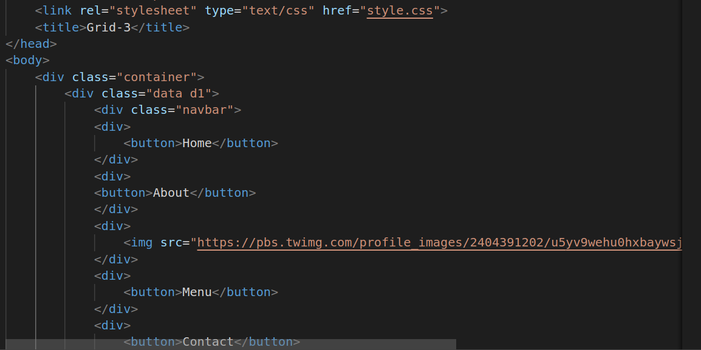
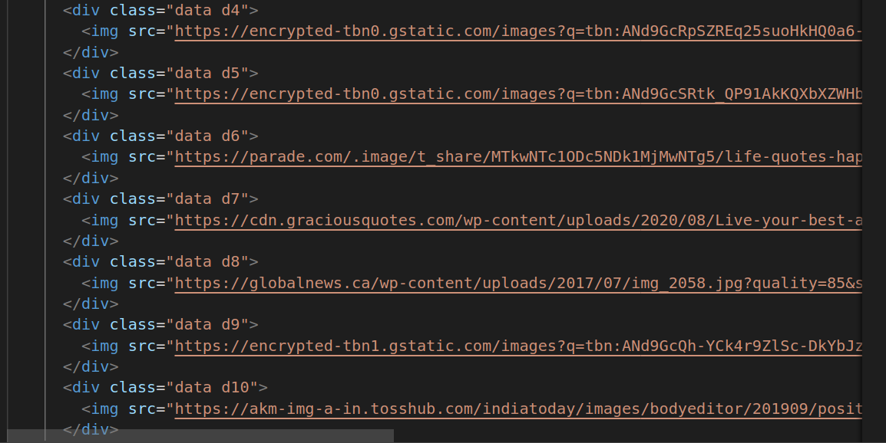
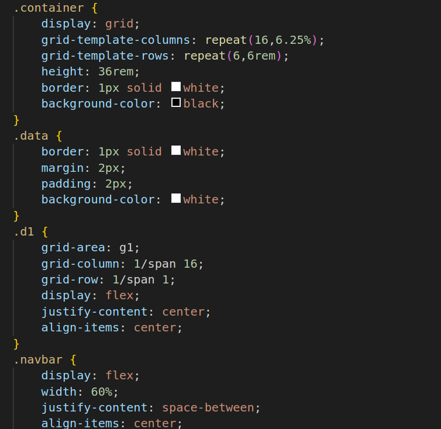
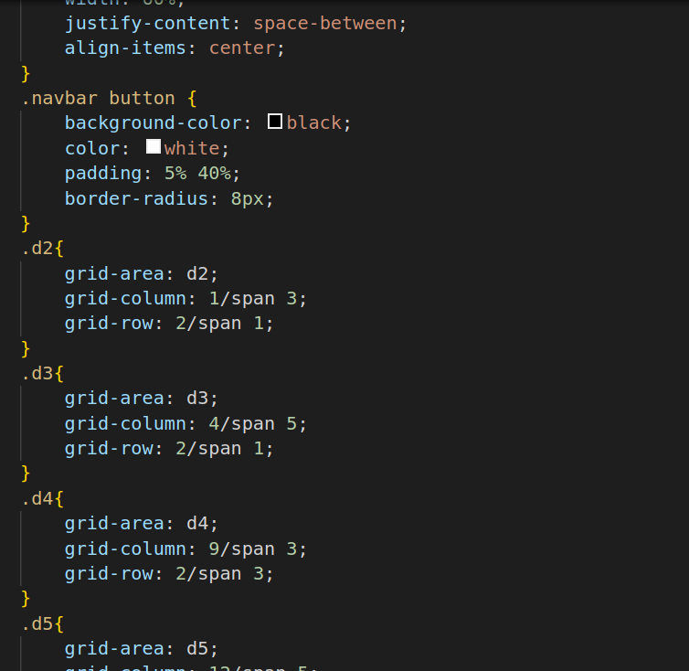
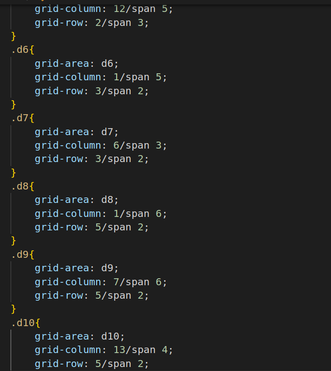

# Grid-Structure
1.

2.

* link: This tag is used to link an external resource to the HTML document. In this case, it's linking an external CSS stylesheet named "style.css" to apply styles to the HTML content.
* title: The title element sets the title of the web page, which is typically displayed in the browser's title bar or tab.
* body: The body element contains the main content of the web page, including text, images, and other elements that are visible to the user.
* div: The div element is a generic container that is often used to group and structure content. In this code, it's used to create a container with the class "container."
* button: This element defines a clickable button. There are several buttons with different labels like "Home," "About," "Menu," and "Contact" in this code.
* img: The img element is used to display images on the web page. It has attributes like "src" (source) to specify the image file's URL and "width" and "height" to set the image's dimensions.

3.

* display: grid: This property specifies that the element with the class .container should be treated as a grid container. It enables grid layout for its children.
* grid-template-columns: repeat(16,6.25%): This property defines the columns of the grid. It creates 16 columns, each with a width of 6.25% of the container's width. This creates a 16-column grid layout.
* grid-template-rows: repeat(6,6rem): This property defines the rows of the grid. It creates 6 rows, each with a height of 6rem.
* height: 36rem: This property sets the overall height of the grid container to 36rem (360 pixels). This ensures that the grid has a fixed height.
* border: 1px solid white: This property adds a 1-pixel solid white border around the grid container.
* background-color: black: This property sets the background color of the grid container to black.

* border: 1px solid white: This property adds a 1-pixel solid white border around elements with the class .data.
* margin: 2px: This property sets a 2-pixel margin around elements with the class .data.
* padding: 2px: This property sets a 2-pixel padding inside elements with the class .data.
* background-color: white: This property sets the background color of elements with the class .data to white.

* grid-area: g1: This property assigns the grid area name "g1" to the element with the class .d1. Grid area names are defined in the parent grid container.
* grid-column: 1/span 16;: This property specifies that the element should start in the first column and span 16 columns horizontally within the grid.
* grid-row: 1/span 1;: This property specifies that the element should start in the first row and span 1 row vertically within the grid.
* display: flex;: This property turns the element into a flex container, allowing its child elements to be flex items.
* justify-content: center;: This property horizontally centers the child elements within the flex container.
* align-items: center;: This property vertically centers the child elements within the flex container.
* display: flex;: This property turns the element into a flex container, allowing its child elements to be flex items.
* width: 60%;: This property sets the width of the .navbar element to 60% of its parent's width.
* justify-content: space-between;: This property evenly distributes the child elements along the horizontal axis, creating space between them.
* align-items: center;: This property vertically centers the child elements within the flex container.

4.

* background-color: black;: This property sets the background color of the buttons to black.
* color: white;: This property sets the text color of the buttons to white.
* padding: 5% 40%;: This property adds padding to the buttons, creating space around the text.
* border-radius: 8px;: This property adds rounded corners to the buttons.
* grid-area: d2;: This property assigns the grid area name "d2" to the element with the class .d2. Grid area names are used to place elements within the grid.
* grid-column: 1/span 3;: This property specifies that the element should start in the first column and span 3 columns horizontally within the grid. In this case, it occupies columns 1, 2, and 3.
* grid-row: 2/span 1;: This property specifies that the element should start in the second row and span 1 row vertically within the grid. It occupies only one row.
* grid-area: d3;: This property assigns the grid area name "d3" to the element with the class .d3.
* grid-column: 4/span 5;: This property specifies that the element should start in the fourth column and span 5 columns horizontally within the grid. It occupies columns 4, 5, 6, 7, and 8.
* grid-row: 2/span 1;: This property specifies that the element should start in the second row and span 1 row vertically within the grid.
* grid-area: d4;: This property assigns the grid area name "d4" to the element with the class .d4.
* grid-column: 9/span 3;: This property specifies that the element should start in the ninth column and span 3 columns horizontally within the grid. It occupies columns 9, 10, and 11.
* grid-row: 2/span 3;: This property specifies that the element should start in the second row and span 3 rows vertically within the grid. It occupies rows 2, 3, and 4.
* grid-area: d5;: This property assigns the grid area name "d5" to the element with the class .d5.
* grid-column: 12/span 5;: This property specifies that the element should start in the twelfth column and span 5 columns horizontally within the grid. It occupies columns 12, 13, 14, 15, and 16.
* grid-row: 2/span 3;: This property specifies that the element should start in the second row and span 3 rows vertically within the grid.

5.

* grid-area: d6;: This property assigns the grid area name "d6" to the element with the class .d6.
* grid-column: 1/span 5;: This property specifies that the element should start in the first column and span 5 columns horizontally within the grid. It occupies columns 1, 2, 3, 4, and 5.
* grid-row: 3/span 2;: This property specifies that the element should start in the third row and span 2 rows vertically within the grid. It occupies rows 3 and 4.
* grid-area: d7;: This property assigns the grid area name "d7" to the element with the class .d7.
* grid-column: 6/span 3;: This property specifies that the element should start in the sixth column and span 3 columns horizontally within the grid. It occupies columns 6, 7, and 8.
* grid-row: 3/span 2;: This property specifies that the element should start in the third row and span 2 rows vertically within the grid. It occupies rows 3 and 4.
* grid-area: d8;: This property assigns the grid area name "d8" to the element with the class .d8.
* grid-column: 1/span 6;: This property specifies that the element should start in the first column and span 6 columns horizontally within the grid. It occupies columns 1, 2, 3, 4, 5, and 6.
* grid-row: 5/span 2;: This property specifies that the element should start in the fifth row and span 2 rows vertically within the grid. It occupies rows 5 and 6.
* grid-area: d9;: This property assigns the grid area name "d9" to the element with the class .d9.
* grid-column: 7/span 6;: This property specifies that the element should start in the seventh column and span 6 columns horizontally within the grid. It occupies columns 7, 8, 9, 10, 11, and 12.
* grid-row: 5/span 2;: This property specifies that the element should start in the fifth row and span 2 rows vertically within the grid. It occupies rows 5 and 6.
* grid-area: d10: This property assigns the grid area name "d10" to the element with the class .d10.
* grid-column: 13/span 4: This property specifies that the element should start in the thirteenth column and span 4 columns horizontally within the grid. It occupies columns 13, 14, 15, and 16.
* grid-row: 5/span 2: This property specifies that the element should start in the fifth row and span 2 rows vertically within the grid. It occupies rows 5 and 6.

